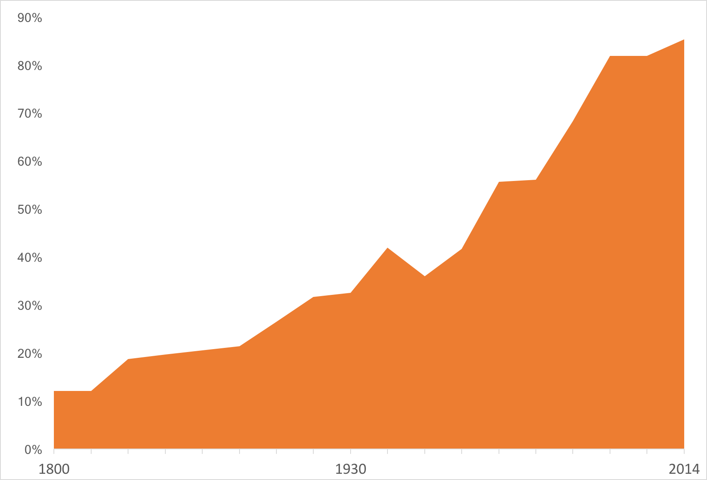
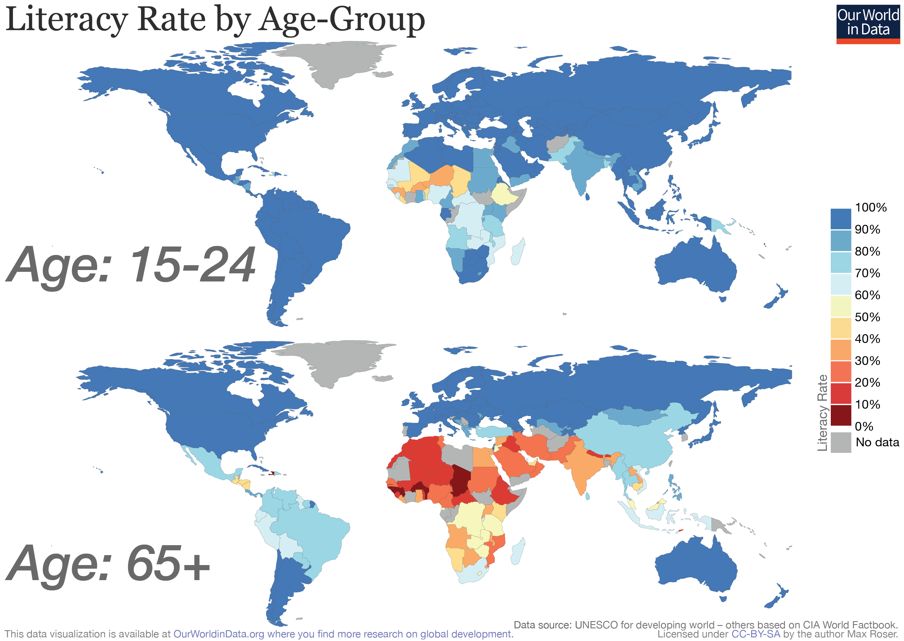

<!-- .slide: data-background-image="images/cippus.jpg" data-background-opacity="0.075" -->

## Writing and the future of Civic Tech

 

### Greg Kempe, OpenUp

greg@openup.org.za

---

# Writing? 

Using the written word to convey ideas.

 

# Civic Tech?

Using technology to enhance the relationship between people and government.

---

<!-- .slide: data-background-image="images/literacy.png" data-background-size="contain" -->

### World literacy rates       

---

# ✍️ 

## Writing For All

"We write anything!"

---

# 👨‍🍳

"I've heard about writing, 
write me a poem!"

---

# ✍️ 

> "Roses are red, Violets are blue."

---

# 👨‍🍳

"The poem doesn't work."

---

# ✍️ 

"Well, what are you trying to achieve?"

---

<!-- .slide: data-background-image="images/jamie.jpg" data-background-size="contain" -->

---

### World literacy rates

---

## Writing is not

a poem 
a journal article 
cookbooks 
tweets 
a novel 
a recipe 
a love letter 
... 

---

## Writing is

putting ideas into written words
 
to communicate and share them

---

## Civic tech is not

an app 
a website 
data portals 
a map 
data journalism 
online procurement 
e-voting 
... 

---

## Civic tech is

software + user-centered design + systems thinking + iterative delivery, applied to civic issues

---

# What's your point?

---

> The future is already here – it's just not evenly distributed. 
– William Gibson

---

## What can we learn from this right now?

---

<!-- .slide: data-background-image="images/literacy-bg.png" data-background-opacity="0.2" -->

## Big changes happen slowly

---

## Improving civic tech literacy
#### (not digital literacy)

Teach government, civil society and funders

Promote supply and demand for civic tech

Talk about tools and processes

Talk about outputs and impact

Good vs poor uses of civic tech

Be patient, expect failures

---

## What can we learn from this in the future?

---

## Growth and Generalisation

---

## Spin-offs and Specialisation

by subject area and output

---

### Full impact is 1-2 generations away

---

# Thank you

 

ourworldindata.org/literacy

